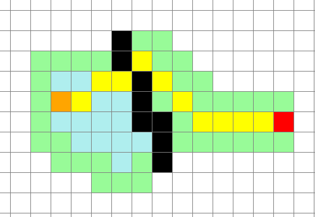
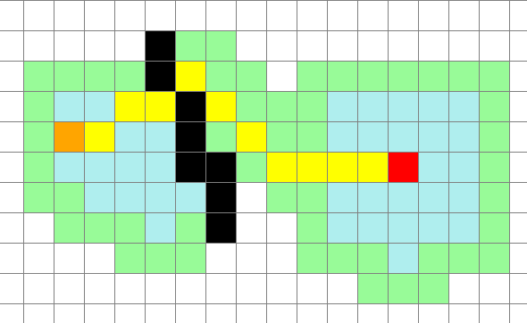

# 实验二: 搜索算法

* 实现了单双向的`A*`搜索算法
* 实现了可视化
* 可通过鼠标键盘控制
* 地图并可以保存到文件，方便下次直接使用

## 使用说明

两个程序`astar.py`和`biastar.py`分别对应了单向和双向的`A*`搜索，程序的使用方法完全一致

* `pip install pygame` 安装依赖pygame
* `python astar.py [mapfile.txt]`
  * 这里的地图文件可以通过按`s`键保存得到，参考下面的COMMANDS
  * 实验中要求的两个地图我已经保存了，对应`map1.txt`和`map2.txt`: `python astar.py map1.txt`运行

## COMMANDS 操作方式

* 鼠标左键 设置某个块儿
  * 默认情况或者按了`0`之后，左键会把点击的块儿设置为**起点**（不存在起点），**终点**（存在起点不存在终点），**障碍**（已存在起点和终点）
  * 按了`1`之后，为点击的块儿设置**额外代价**（经过这个块儿会有额外代价）
  * 按了`2`之后同理，只是额外代价不同
  * 额外的代价见代码中的变量: `EXTRA_COST = [0, 2, 4]`，如果还想有更多的代价往后面加就行了，因为采用一个数字按键对应不同代价，所以最多可以有9种额外代价，对应按键/下标: `1-9`.
  
* 鼠标右键 清除某个块儿

* 键盘`q` 退出程序

* 键盘`s` 保存当前地图到当前目录，按时间命名

  * `python astar.py map01.txt`加载地图`map01.txt`运行

  * 下面对地图文件的格式做说明，比如对于第二个地图`map02.txt`

    ```txt
    20 40 34
    0 0 0 -1 0 0 0 -1 0 0 0 0 -1 0 0 0 0 0 0 0 0 0 0 0 2 2 2 2 2 2 2 2 2 2 2 T2 2 2 2 2 
    0 0 0 0 0 0 0 -1 0 0 0 0 -1 0 0 0 0 0 0 0 0 0 0 0 0 2 2 2 2 2 2 2 2 2 1 2 2 2 2 2 
    -1 -1 -1 -1 -1 -1 0 -1 -1 -1 -1 0 -1 0 0 0 0 0 0 0 0 0 0 0 0 0 2 2 2 2 2 2 2 1 2 2 2 2 2 2 
    0 0 0 0 0 0 0 0 -1 0 0 0 -1 0 0 0 0 0 0 0 0 0 0 0 0 0 2 2 2 2 2 2 1 2 2 2 2 0 0 0 
    0 0 0 0 0 0 0 0 0 0 0 0 -1 0 0 0 0 0 0 0 0 0 0 0 0 0 2 2 2 2 2 2 2 1 2 2 0 0 0 0 
    0 0 0 0 0 0 0 -1 -1 0 0 0 -1 0 0 0 0 0 0 0 0 0 0 0 0 0 0 2 2 2 2 2 2 1 1 0 0 0 0 0 
    0 0 -1 -1 -1 -1 -1 -1 0 0 0 0 -1 0 0 0 0 0 0 0 0 0 0 0 0 0 0 2 2 2 2 2 2 1 1 0 0 0 0 0 
    0 0 -1 0 0 -1 0 -1 0 0 0 0 -1 0 0 0 0 0 0 0 0 0 0 0 0 0 0 0 0 2 2 2 2 1 1 1 -1 0 0 0 
    0 0 0 0 0 -1 0 0 0 0 0 0 0 0 0 0 0 0 0 0 0 0 0 0 0 0 0 0 0 0 0 0 1 1 1 1 0 0 0 0 
    0 0 0 0 0 -1 0 -1 0 0 0 0 0 0 0 0 0 0 0 0 0 0 0 0 0 0 0 0 0 0 0 0 1 1 1 0 -1 0 0 0 
    0 0 -1 0 S0 -1 0 -1 -1 0 0 0 0 0 0 0 0 0 0 -1 -1 -1 0 0 0 0 0 0 -1 0 0 0 1 1 0 1 1 0 0 0 
    0 0 -1 -1 -1 -1 0 0 -1 0 0 0 0 0 0 0 0 0 0 -1 -1 -1 0 0 0 0 0 0 0 0 0 -1 1 0 1 1 0 0 0 0 
    0 0 0 -1 0 0 0 0 -1 0 0 0 -1 0 0 0 0 0 0 -1 -1 -1 0 0 0 0 0 0 0 0 0 0 0 1 1 0 0 0 0 0 
    0 0 0 -1 0 0 0 0 -1 -1 0 -1 -1 0 0 0 0 0 0 0 0 0 0 0 0 0 0 0 0 0 0 -1 1 1 1 0 0 0 0 0 
    0 0 0 -1 0 0 0 0 -1 0 0 0 -1 0 0 0 0 0 0 0 0 0 0 0 0 0 0 0 0 0 0 0 1 1 1 0 0 0 0 0 
    0 0 0 -1 -1 -1 -1 -1 -1 0 0 0 -1 0 0 0 0 0 0 0 0 0 0 0 -1 -1 0 0 0 0 0 1 1 1 0 0 0 0 0 0 
    0 0 0 -1 0 0 0 0 0 0 0 0 -1 0 0 0 0 0 0 0 0 0 0 0 -1 -1 0 0 0 0 0 1 1 1 0 0 0 0 0 0 
    0 0 0 0 0 0 0 -1 0 0 0 0 -1 0 0 0 0 0 0 0 0 0 0 0 0 0 0 0 0 0 1 1 1 0 0 0 0 0 0 0 
    0 0 0 -1 0 0 0 -1 0 0 0 0 -1 0 0 0 0 0 0 0 0 0 0 0 0 0 0 0 0 1 1 1 0 0 0 0 0 0 0 0 
    0 0 0 -1 0 0 0 -1 0 0 0 0 -1 0 0 0 0 0 0 0 0 0 0 0 0 0 0 0 1 1 1 0 0 0 0 0 0 0 0 0 
    ```

    第一行三个整数`m,n,gap`分别表示地图格子有`m`行，`n`列，每个格子都是`gap*gap`像素大小的正方形块儿

    接下来的m行n列整数具体代表了地图信息，一共有三种格子：

    * `-1`表示障碍

    * `0`表示可以行走的块，并且没有额外代价

    * `1-9`代表了可以行走的块，但是具有额外代价，这个数字代表了额外代价的下标，比如程序中的额外代价定义如下，表示下标1对应代价为2，下标2对应代价为4

      ```python
      # LAND, RIVER, DESERT
      EXTRA_COST = [0, 2, 4]
      ```

* 键盘`<SPACE>` 开始/暂停/继续路径搜索

* 键盘`c` 清除搜索痕迹(搜索过程中不可用)

* 键盘`n` 清空地图(搜索过程中不可用)

## 运行效果

* 单向`A*`，使用`map01.txt`

  

* 双向`A*`，使用`map01.txt`

  

* 单向`A*`，使用`map02.txt`

  

* 双向`A*`，使用`map02.txt`

  

